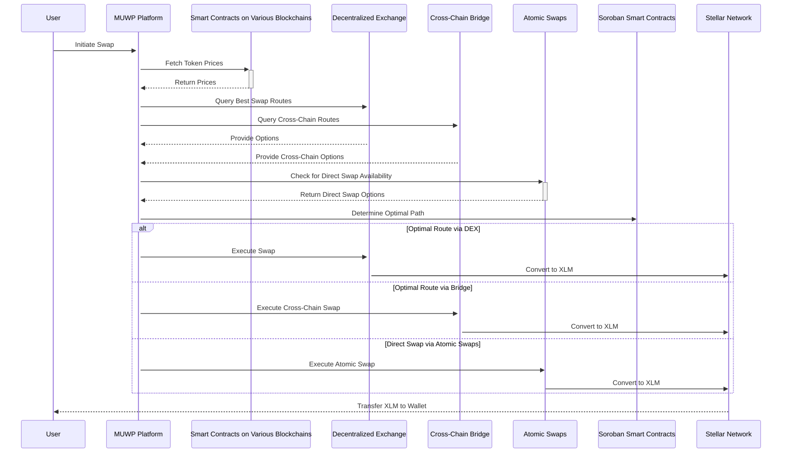

## **Technical Architecture Diagram** 

***

***

##  Multi-Path Swap Process with MUWP for Stellar

This sequence diagram illustrates the process a user goes through to perform a token swap using MUWP. MUWP  facilitates swaps across various blockchains by finding the most optimal route for the user's XLM.

Here's a breakdown of each step:

**1. User Initiates Swap**

* The user interacts with the MUWP platform and initiates the swap process. This could involve specifying the desired source and destination tokens and the amount to be swapped.

**2. MUWP Fetches Token Prices**

* The MUWP platform interacts with smart contracts deployed on various blockchains relevant to the user's swap request.
* These smart contracts likely provide functionality to access current token prices or exchange rates.

**3. Smart Contracts Return Prices**

* The smart contracts on various blockchains respond to the MUWP's request by sending back the retrieved token prices.

**4. MUWP Queries Swap Routes**

* The MUWP platform utilizes two potential routes for the swap:

    * Decentralized Exchanges (DEXs): The MUWP queries DEXs to find the best exchange routes for swapping tokens directly within the user's chosen blockchain.

    * Cross-Chain Bridges: The MUWP queries cross-chain bridges to explore the possibility of swapping tokens across different blockchains.

**5. DEX and Bridge Respond**

* The DEXs provide the MUWP with details about the available swap options and their associated rates. These options might involve converting the source token to multiple intermediate tokens before reaching the desired destination token XLM.

* Similarly, the cross-chain bridges respond with information about the cross-chain swap possibilities. This could involve wrapping the source token on one blockchain, sending it to another chain via the bridge, and then unwrapping it for the desired destination token XLM.

**6. MUWP Checks for Direct Swap**

* The MUWP platform additionally checks for the availability of direct swaps using Atomic Swaps (AS).

* Atomic Swaps allow for trustless peer-to-peer exchange of tokens without relying on a centralized party.

**7. AS Responds with Options (if applicable)**

* If direct atomic swaps are possible for the user's desired exchange, the AS module within the MUWP platform would respond with details about this option.

**8. MUWP Determines Optimal Path**

* The MUWP platform analyzes the information received from various sources:

    * Token prices from smart contracts
    * Swap options and rates from DEXs
    * Cross-chain swap options and fees from bridges
    * (Optional) Direct swap details from atomic swaps

* Based on this comprehensive analysis, the MUWP platform determines the most optimal route for the user's swap in terms of factors like cost, efficiency, and potential delays.

**9. Execute Swap Based on Optimal Route**

Depending on the chosen path, the MUWP interacts with the selected service:

* **DEX**: The MUWP executes the swap through the chosen DEX, potentially involving multiple token conversions. 
* **Bridge**: The MUWP executes the cross-chain swap through the chosen bridge, which involves wrapping, transferring, and unwrapping tokens.
* **Atomic Swaps**: If direct swap is chosen, the MUWP facilitates the atomic swap process.

**10. Convert to XLM (Stellar Network)**

* Regardless of the chosen swap route, the final step involves converting the obtained tokens to XLM (the native token of the Stellar Network) for delivery to the user's wallet.

**11. Transfer XLM to User's Wallet**

* Finally, the Stellar Network transfers the swapped XLM tokens to the user's designated wallet address. 

**This sequence diagram showcases how the MUWP smart protocol leverages various blockchain services path to find the most efficient and cost-effective route for users to swap XLM from STELLAR across different blockchains.**
