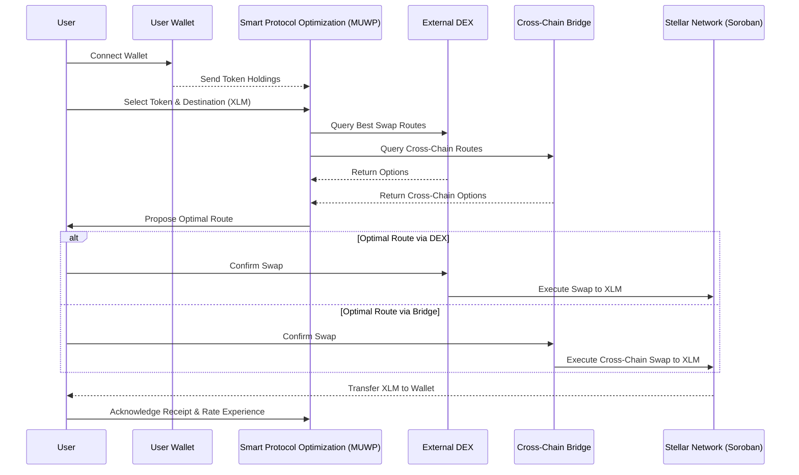

## MUWP on STELLAR Sequence Diagram

***

MUWP seamlessly facilitates cross-chain token swaps to Stellar's XLM, leveraging user interactions, AI protocol optimization, and Soroban Smart Contracts for a streamlined experience.

## Detailed Explanation of the Diagram:

1. **User connects their wallet**: Establishes a secure connection, enabling MUWP to access their holdings for swaps.

2. **Wallet sends token holdings to Smart Protocol**: Identifies assets available for swapping, essential for route optimization.

3. **User selects token and destination (XLM)**: User-driven decision process, initiating the swap.

4. **Smart Protocol queries DEX and Bridge for routes**: Gathers possible swap paths, crucial for covering both on-chain and cross-chain options.

5. **DEX and Bridge return options to Smart Protocol**: Enables the Smart Protocol to analyze and select the most efficient swap route.

6. **Smart Protocol proposes the optimal route**: Enhances user experience by recommending the most cost-efficient and swift path.

7. **User confirms the swap via the chosen route**: User consent is crucial for proceeding with the transaction.

8. **Execution of the swap on Stellar, facilitated by Soroban smart contracts**: For routes directly on Stellar, Soroban smart contracts are employed to execute the swap securely and efficiently, leveraging Stellar's blockchain capabilities.

9. **XLM transfer to the user's wallet**: The culmination of the swap, with XLM delivered to the user, highlighting the successful operation.

10. **User acknowledges receipt and rates experience**: Feedback mechanism for service improvement, indicating user satisfaction.
